
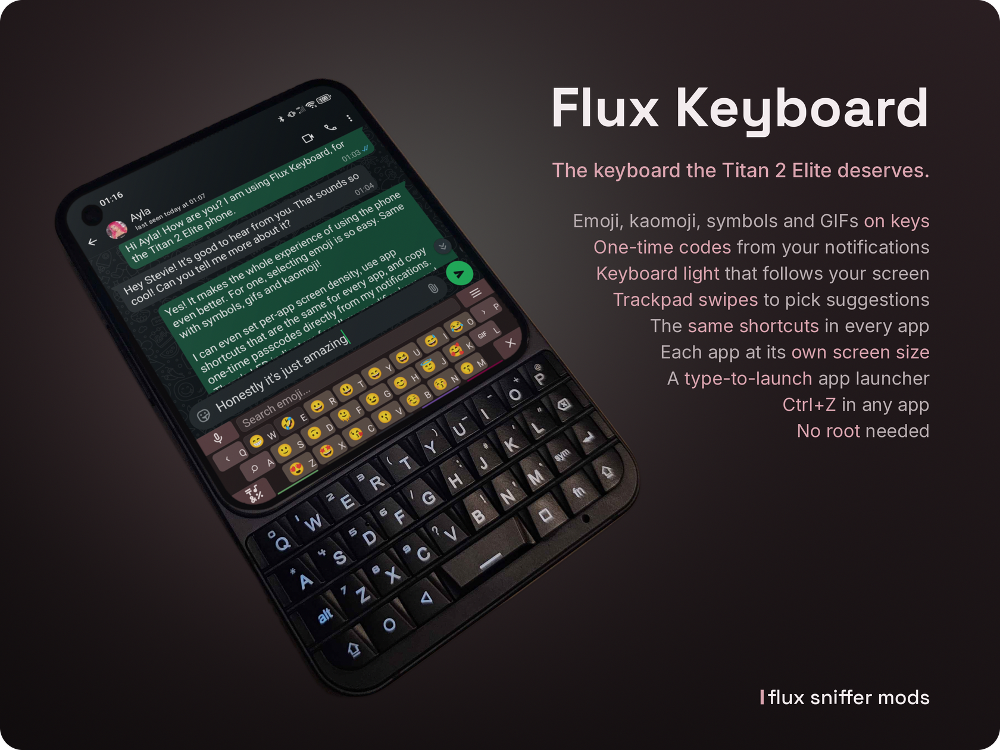

# Flux Keyboard

**The companion app for the Unihertz Titan 2 Elite.** A keyboard first, built around its physical
keys and trackpad, and an app that makes the rest of the phone better too: the
keyboard light, screen size per app and shortcuts for things the phone hides away, all without
root. It works on any Android phone with a hardware keyboard, and is at its best on the Titan 2 Elite.

> **Flux Keyboard** is an unofficial fork of [Pastiera](https://github.com/palsoftware/pastiera),
> created by Andrea Palumbo (PalSoftware) and developed by Andrea Palumbo, Patrick Zauner and the
> Pastiera contributors. Most of what makes it a keyboard is their work, credited
> [below](#built-on-pastiera). Flux Keyboard is not affiliated with or endorsed by the Pastiera
> team, so please report problems to [this repository](https://github.com/Flux-Sniffer-Mods/Flux-Keyboard/issues),
> not upstream.

Flux Keyboard is up to date with **Pastiera 0.86**, Pastiera's final planned feature release, and
merges Pastiera's later changes as they land. Pastiera keeps receiving security fixes, and its
development continues as [Plektra](https://github.com/pkb-rocks/plektra).

## Only in Flux Keyboard

### The trackpad picks your words
- **Swipe on the keys to pick a suggestion**: left, up or right for each of the three, down to delete a word. It learns how far you swipe, and with Shizuku it works in every app, not only the ones the phone's Scroll assistant scrolls.

  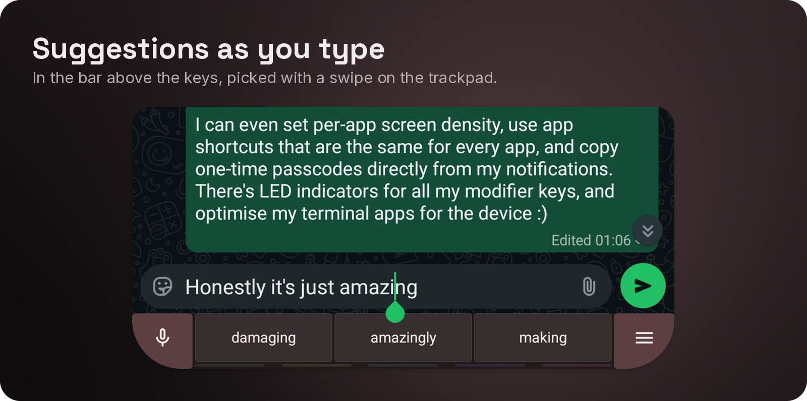

### Emoji, symbols, kaomoji and GIFs on the keys
- **Pages on the keys**: Q and P turn through every emoji by category, symbols (arrows, maths, currency, punctuation, shapes) and over 300 kaomoji, opening on a default page you map yourself, Developer's pick to start, with your recents a page back. Tap SYM or the emoji key for one, with no screen in the way.

  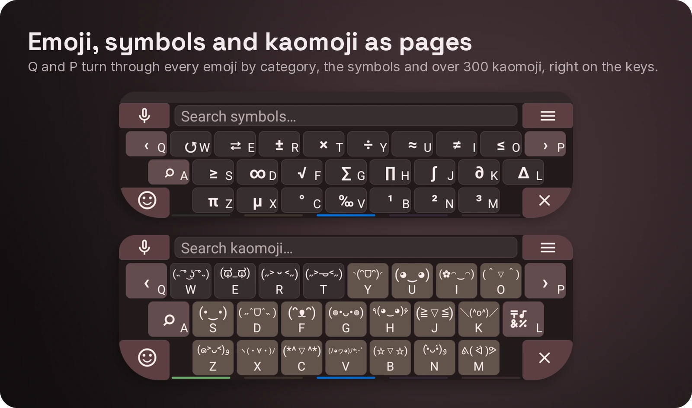

- **Search everything**: emoji by name, every Unicode symbol, and kaomoji by mood, action or name, each search with tabs that jump straight to a group.

  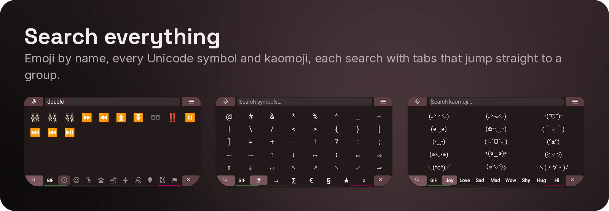

  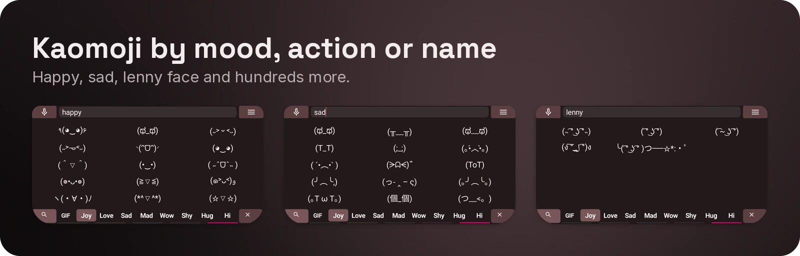

- **GIFs with favourites**: search from the emoji pages or the picker, with quick searches in the bar, and star the ones you want to keep.

  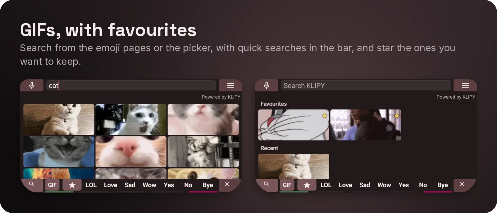

- **Skin tones** one per key, with a default of your choice.

  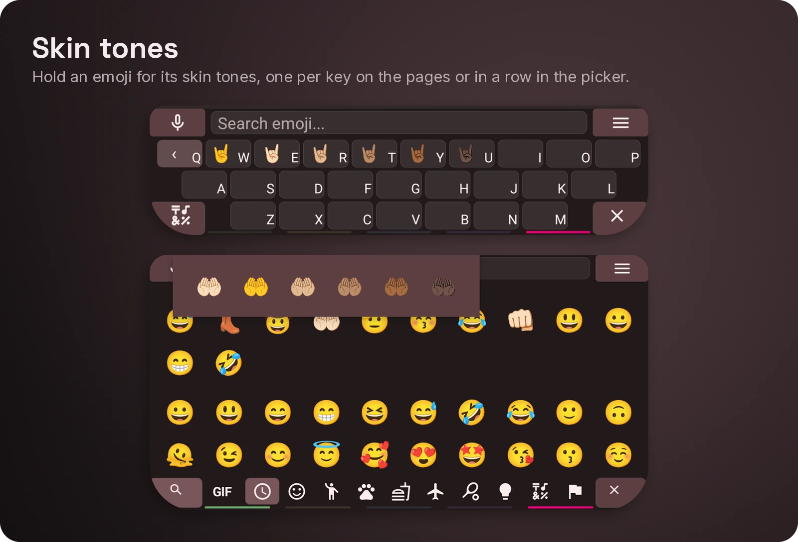

### The rest of the phone, without root
- **Its own shell, no Shizuku needed**: pair once with wireless debugging and Flux Keyboard starts its own developer shell after every restart, as soon as Wi-Fi connects. Shizuku still works if you use it.
- **Gaming mode**: in a game, the keys reach it as they are, mapped once in the emulator's or launcher's own controller settings, and the trackpad becomes its sticks: the on-screen sticks of GameNative's and GameHub's games, or the direction keys an emulator maps like any other. A profile per game, including the games in GameNative, GameHub and GameHub Lite and the ones in your emulator folders, named by their game IDs, each with its own home screen shortcut and art. The screen turns the way each game suits, clear of the camera cutout.
- **Keyboard light that follows the screen**: on and off with it, following its brightness as it changes, or flashing for notifications.

  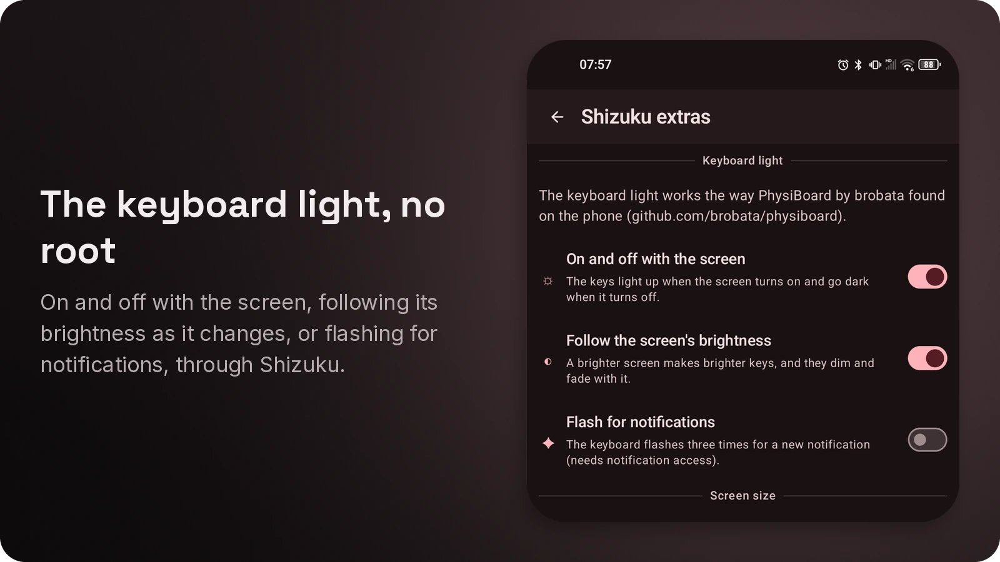

- **Shortcuts the phone hides away**: force-stop the app in front, toggle Battery Saver or cut an app off the network, from a key.

### Typing that knows where it is
- **One-time codes from your notifications**, password managers' autofill chips in the bar, and copied passwords offered without ever being shown.

  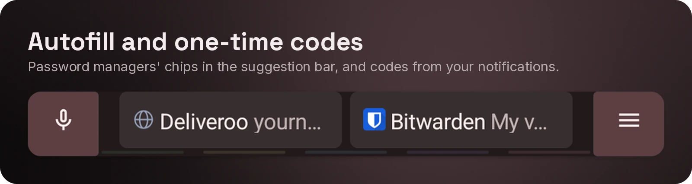

- **Ctrl+Z in any app**, the same app shortcuts in every app, and Enter that sends or adds a line the way each app expects.

  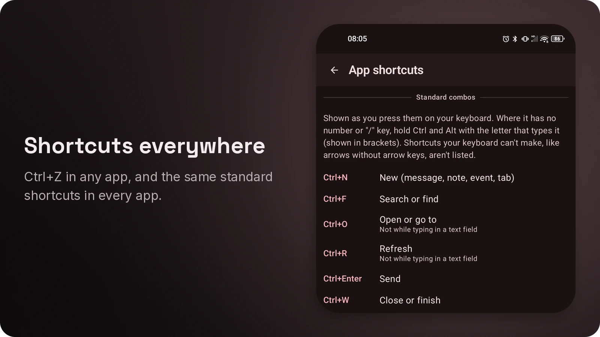

- **A quick launcher that does more**: apps and their own shortcuts (Discord's "New message"), contacts to call or message, websites, Termux scripts, or Niagara search if you prefer it.

  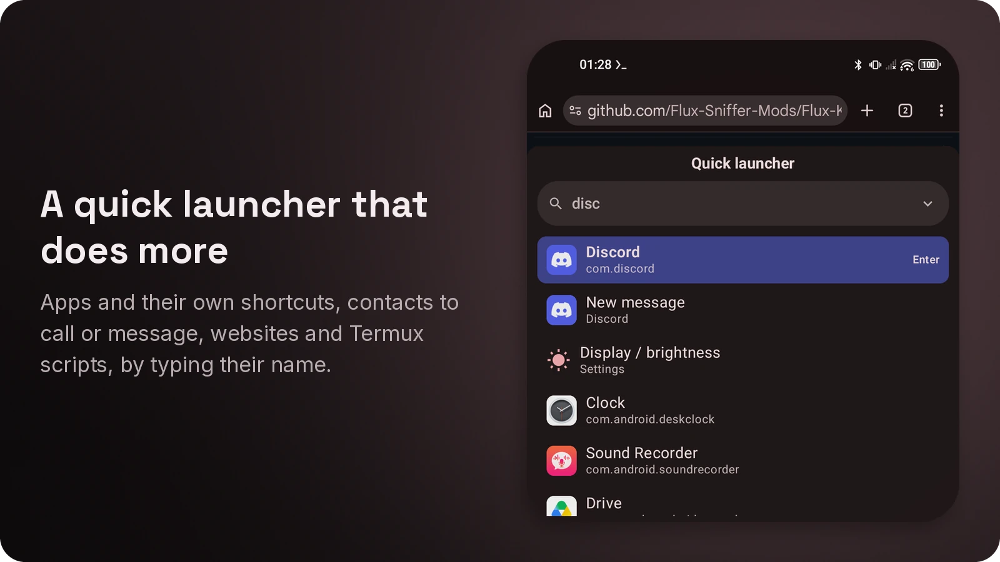

- **Clean links**: tracking and Google, Facebook and Instagram redirects gone from what you copy and paste.

### Terminals done properly
- **Terminal mode** for Termux: the keyboard out of sight with just its LEDs, Alt and SYM for symbols, Ctrl staying Ctrl, and Nav Mode and swipes on the keys moving the cursor.
- **Extra keys**: Esc, Tab, Ctrl, Alt and arrows in the bar's place, opened with the emoji key in a terminal (or from the menu, or a shortcut). While it's open, Q to P press them. Text fields get their own set: arrows, Home, End, cut, copy and paste.
- **Termux set up in one paste**, including Shizuku starting by itself after a restart (with Termux:Boot).

  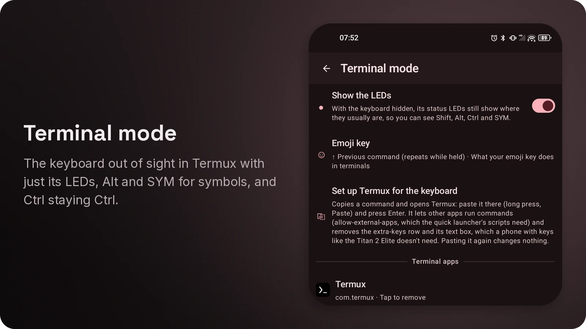

### Made to look right
- **Modifier LEDs** with a colour each: Shift, Alt, SYM, Ctrl, and a fifth for the emoji key, drawn along the Titan 2 Elite's display contour if you like.

  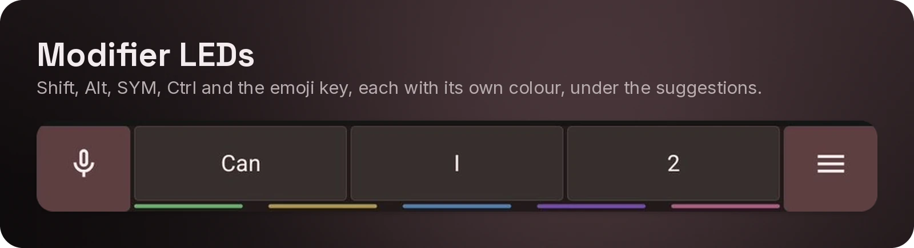

- **A background picture** behind the keys, and **themes** for light and dark, with colours from your wallpaper and every colour editable.

  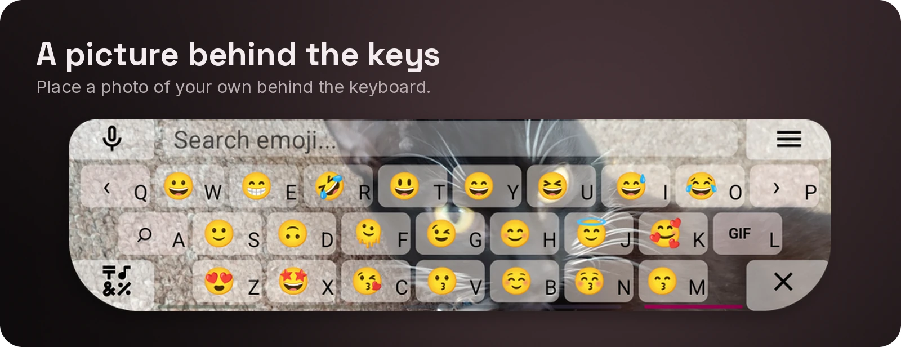

  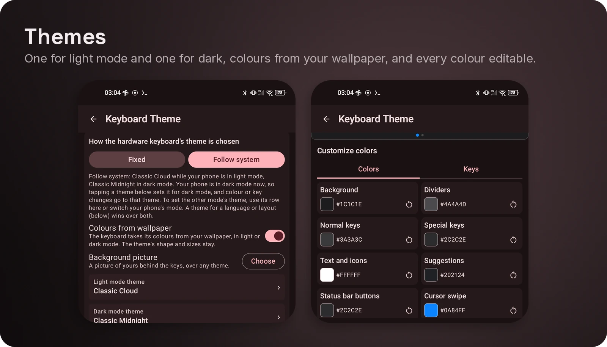

- **Recommended settings**: the setup it's tuned with on the Titan 2 Elite, applied in one step and offered again after updates as a "from → to" list, with a tutorial that walks through permissions, Shizuku and the rest.

  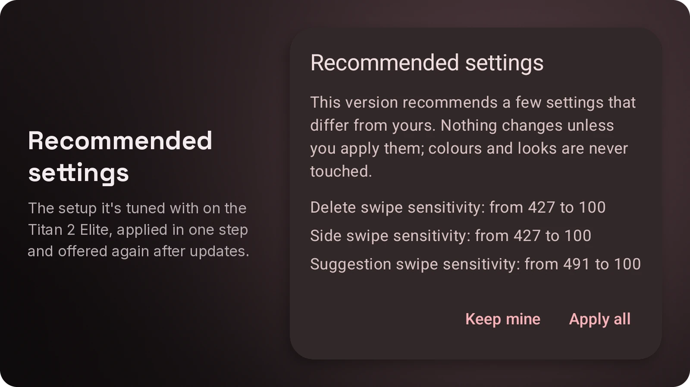

  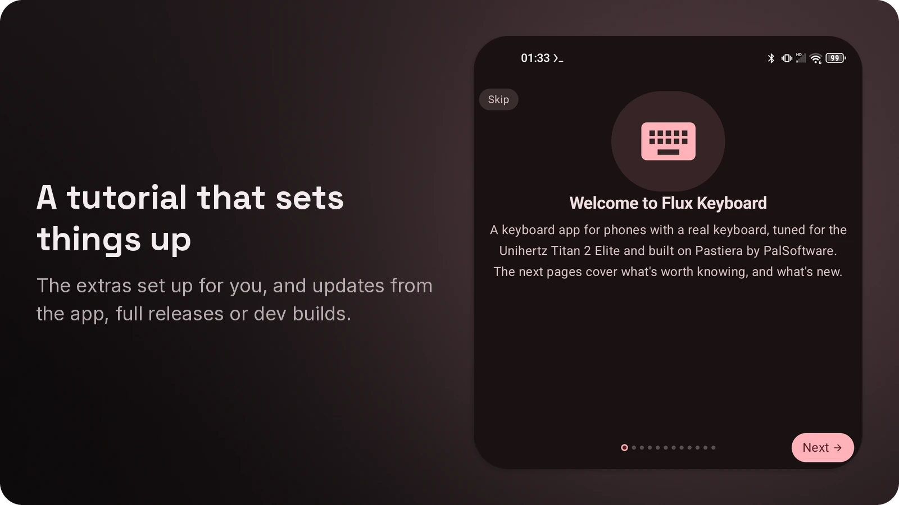

## Also here, all in one app

Things you'd otherwise need a different fork for, side by side with everything above:

- **Minimal mode**: no keyboard bar in any app, the LEDs optional, emoji and symbols still on their keys.
- **Screen size presets** for the whole phone: Default, Tablet and Desktop, each one tap.

  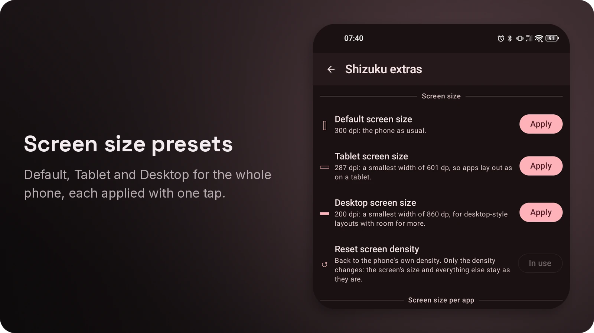

- **Screen size per app**: each app at its own size, kept through the recent apps screen and back to yours when you leave. The same app at two sizes:

  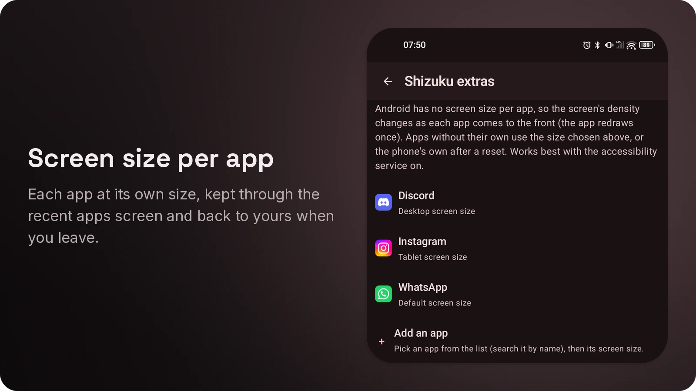

  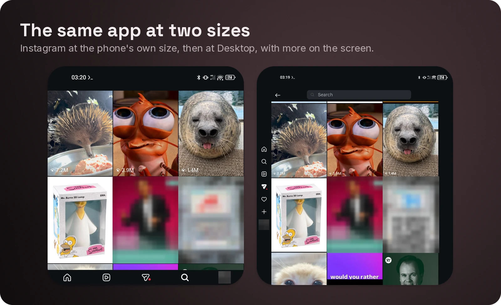

- **One language per download**: each full release comes as an APK per language, opening in its translation and its usual layout. Other languages' dictionaries download when you add them.
- **Undo that steps back** through what you typed, one chunk at a time.
- **Voice input that keeps listening**, from the bar or a key.
- **Exact typing per app** (no corrections or capitals where they get in the way) and languages remembered per app.
- **Shift, Alt and Ctrl your way**: what a tap does, whether two taps lock it, and whether it lets go after use, side by side.

  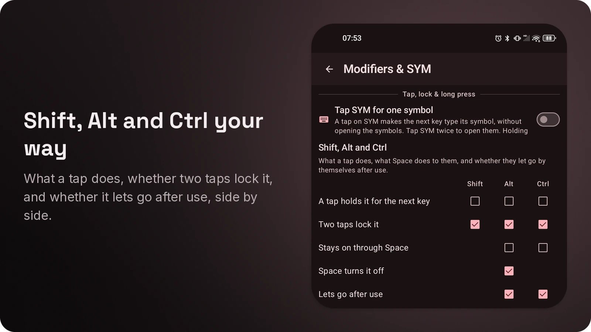

- **No root**: its own shell (or Shizuku) for everything that needs Android's shell.
- **Private mode**: Incognito typing and Offline mode together, on one key.

Everything else, including automatic Shift by field type and snippet placeholders, is in the
[changelog](FORK_CHANGES.md).

## Built on Pastiera

These are the Pastiera team's work, which Flux Keyboard builds on and keeps. Thank you to Andrea
Palumbo, Patrick Zauner and every Pastiera contributor.

**Typing and modifiers**
- Long press for Alt or Shift characters, with configurable timing.
- Shift, Ctrl and Alt as one-shot or locked (double tap), configurable latching, and clearing Alt on space.
- Multi-tap for keys with several characters (for example Cyrillic), and bounce keys.
- Standard shortcuts: Ctrl+C/X/V/A, Ctrl+Backspace, arrows on Ctrl+E/S/D/F or I/J/K/L, selection, Tab, Page Up/Down and Esc, all customisable.
- **Nav Mode**: double tap Ctrl outside text fields for arrows and many more mappings, with word navigation and media controls.
- Double space for a full stop and a capital, configurable punctuation spacing (French spacing, brackets, commas) and smart quotes.

**Layouts and languages**
- QWERTY, AZERTY, QWERTZ, Greek, Arabic, Russian and Armenian phonetic transliteration and more, with Alt maps for the Titan 2, Titan 2 Elite and original Titan.
- Layout switching with a tap on the language code, Ctrl+Space or Alt+Enter; JSON import and export with a preview.
- The layout web editor at [pastierakeyedit.vercel.app](https://pastierakeyedit.vercel.app/).
- A translated interface (English, Italian, German, Greek, Spanish, French, Armenian, Polish, Russian, Ukrainian, Vietnamese) and the onboarding tutorial.

**Status bar, symbols and variations**
- The compact status bar with modifier LEDs, the variations and suggestions bar, and Solderina, the smallest bar (Pastierina in Pastiera).
- The Titan 2 Elite's rounded-display geometry, its display contour calibration and Pastiera's contour LEDs, which Flux Keyboard's contoured LEDs grew from.
- SYM pages for emoji, symbols and the clipboard, usable by touch or keys, with an in-app SYM editor, emoji grid and Unicode picker.
- The variations bar: accents of the last letter or static sets, its editor, and dragging it as a swipe pad to move the cursor.
- Clipboard history with pinned items, hidden while the phone is locked.

**Suggestions and corrections**
- Dictionary suggestions and auto-correction, suggestions from several dictionaries, learned next words, and adding words from a swipe or a substitution.
- The user dictionary with search and editing, per-language substitutions and the shared "Pastiera Recipes".
- Snippet expansion, and emoji and symbol shortcodes.
- Native trackpad gestures on the Titan 2 and Titan 2 Elite (directly or through Shizuku), with separate sensitivities.

**Apps and extras**
- Launcher shortcuts (press a letter to open an app), power shortcuts with SYM anywhere, and the QuickLauncher with Niagara search.
- Enter behaviour per app.
- Speech input from Alt+Ctrl or the microphone on the bar.
- The on-screen keyboard mode with themes, a theme editor, per-app themes, presets, a number row and long-press layers.
- Clicks Power Keyboard support: controls, firmware status and SYM profiles.
- Backup and restore in a ZIP (settings, layouts, variations, SYM and Ctrl maps, dictionaries, themes and typing sounds), Android auto-backup, and the searchable settings with shareable links.

The full list of what Pastiera 0.86 added over 0.85 is in the [changelog](FORK_CHANGES.md#from-the-pastiera-team-085-to-086).

## Installation

1. Download the APK from the [latest release](https://github.com/Flux-Sniffer-Mods/Flux-Keyboard/releases/latest), or a dev build (marked Pre-release) from [all releases](https://github.com/Flux-Sniffer-Mods/Flux-Keyboard/releases).
2. Android Settings → System → Languages & input → Virtual keyboard → Manage keyboards.
3. Enable "Flux Keyboard" and pick it when typing.

Flux Keyboard (app ID `io.github.fluxsniffermods.fluxkeyboard`) installs next to Pastiera and
doesn't replace or update it.

## Requirements

- Android 10 (API 29) or newer.
- A phone with a physical keyboard (profiled on the Unihertz Titan 2 and Titan 2 Elite, adaptable with JSON layouts).

## Building

- Build a debug APK with `./gradlew :app:assembleStableDebug` and run the tests with `./gradlew :app:testStableDebugUnitTest`.
- Signed builds come from `.github/workflows/fork-build.yml`, picked by the branch it runs on:
  - **`flux-release` (the default branch): full releases** such as `1.0.0`, tagged `flux/v1.0.0`. The version is the newest one in the `"releases"` list of `app/src/main/assets/fork/whats_new.json`, which also records when it was built.
  - **`flux-dev`: dev builds** such as `1.0.1-flux.202610061200`, named after the next patch release (so the next full release, patch or minor, supersedes and installs over them) plus the build time, published as pre-releases.
- Each release lists only what changed since the build before it (a full release since the previous full release, a dev build since the previous build of either kind), from the What's new entries' `"after"` times.
- The repository's "Latest" release is always the latest full release. The app's update check reads the release tags: Stable offers full releases, Dev offers both.
- Dev work goes on `flux-dev` as individual commits, one per change, and Pastiera's changes are merged into it as they land. For a full release, add it to `"releases"`, fold the commits since the last full release into category commits, move `flux-release` up to the result and run the workflow on `flux-release`. Commits at or below `flux-release` are never rewritten.
- A full release deletes the dev builds before it (their releases and tags) when it publishes; builds run one at a time.
- `tools/find-keyboard-gesture-page.sh` (as root from Termux, with the page open) prints which screen a phone's keyboard gesture settings are.
- `tools/find-scroll-assistant.sh` (from Termux, through Shizuku's rish or as root) shows where the phone's Scroll assistant keeps its switch and app list, and how it scrolls apps while no keyboard is showing.

Pastiera's release, nightly and CI workflows aren't kept: Flux Keyboard builds only with
`fork-build.yml`. When Pastiera changes them, a merge keeps them deleted.

## Contributing

Issues and suggestions for Flux Keyboard go to [this repository](https://github.com/Flux-Sniffer-Mods/Flux-Keyboard/issues).
Pastiera itself now accepts security, compatibility and maintenance changes, with feature work in
Plektra.

Flux Keyboard follows [Pastiera's forking policy](https://github.com/palsoftware/pastiera#forking-policy):
its own name, application ID, update feed and branding, the copyright and licence notices kept, and
no claim to be an official Pastiera release.

## Licence and credits

Pastiera is licensed under the [GNU General Public License v3](LICENSE), and Flux Keyboard is
distributed under the same licence. Pastiera was created by Andrea Palumbo (PalSoftware) and is
developed by Andrea Palumbo, Patrick Zauner and the contributors credited in the app's About screen
and in the [upstream repository](https://github.com/palsoftware/pastiera). Third-party components
are listed in [THIRD_PARTY_NOTICES.md](THIRD_PARTY_NOTICES.md), and the fork's changes in
[FORK_CHANGES.md](FORK_CHANGES.md).

The Titan 2 Elite's keyboard light through Shizuku (the vendor service's timeout, the
never-off value and the broadcast that turns the light off) follows what
[PhysiBoard](https://github.com/brobata/physiboard) by brobata found and documented on the
phone. Thank you to brobata.

Minimal mode and the single-language versions were inspired by
[Numen](https://github.com/jlo-aug/numen) by jlo-aug, a Pastiera-based keyboard for the Titan 2
Elite with a hidden bar and a build tuned for one language. Thank you to jlo-aug.

Gaming mode names Wii, GameCube and 3DS games from [GameTDB](https://www.gametdb.com)'s
lists of game titles, fetched when a game folder is first read, and shows their covers from
GameTDB too, or box art from [libretro-thumbnails](https://github.com/libretro-thumbnails)
for other emulator games. Builds given a SteamGridDB API key (the `STEAMGRIDDB_API_KEY` Actions
secret) look on [SteamGridDB](https://www.steamgriddb.com) first.

If you enjoy Flux Keyboard, you can [support me on Ko-fi](https://ko-fi.com/fluxsniffermods),
and the people it's built on:
[Pastiera on Open Collective](https://pastiera.eu/donate) and
[Andrea Palumbo on Ko-fi](https://ko-fi.com/palsoftware).

 

  <a href="https://github.com/Flux-Sniffer-Mods">
    <picture>
      <source media="(prefers-color-scheme: dark)" srcset="docs/branding/flux-sniffer-mods-dark.png">
      
    </picture>
  </a>

